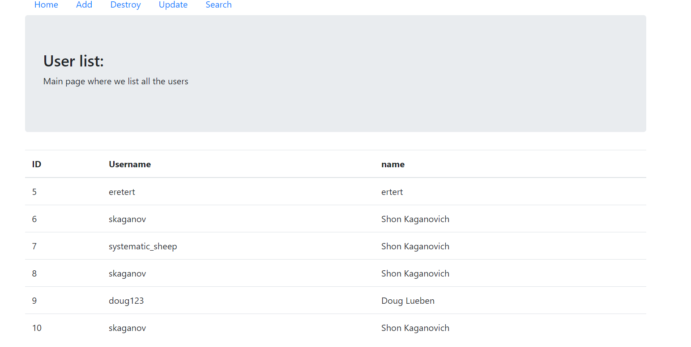

# basic-full-stack-app
Just a basic full stack app that connects SQLAlchemy, Flask, and Bootstrap.

### Run Dirctions

```bash
pip3 install flask
pip3 install flask_sqlalchemy
python .\main.py
```

